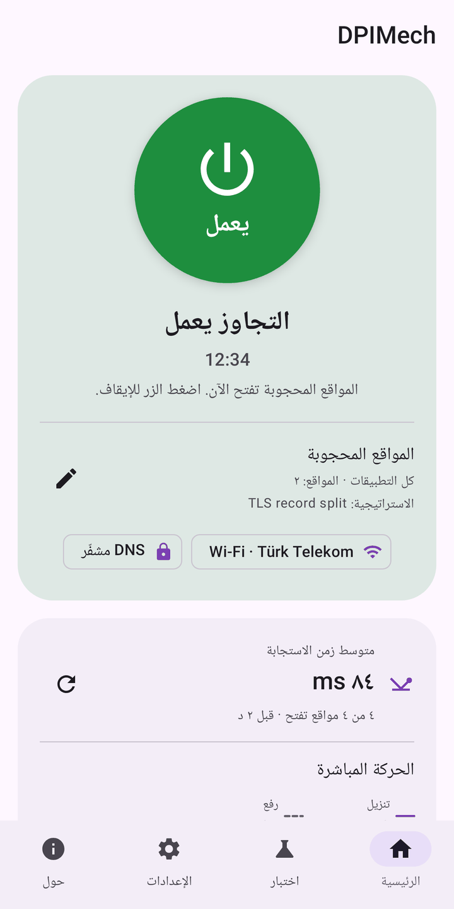
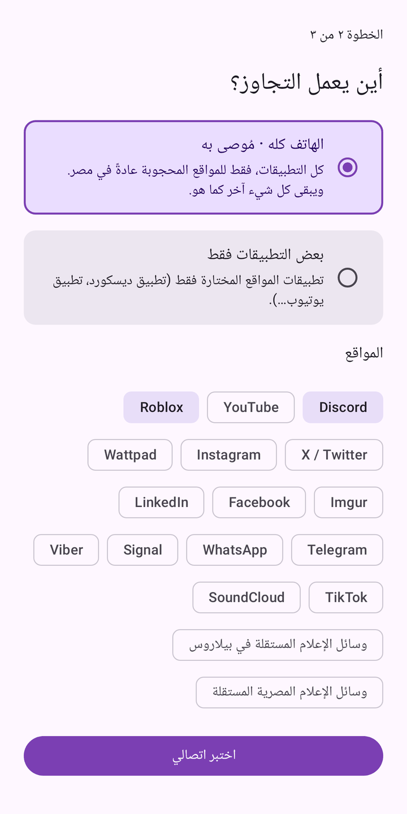
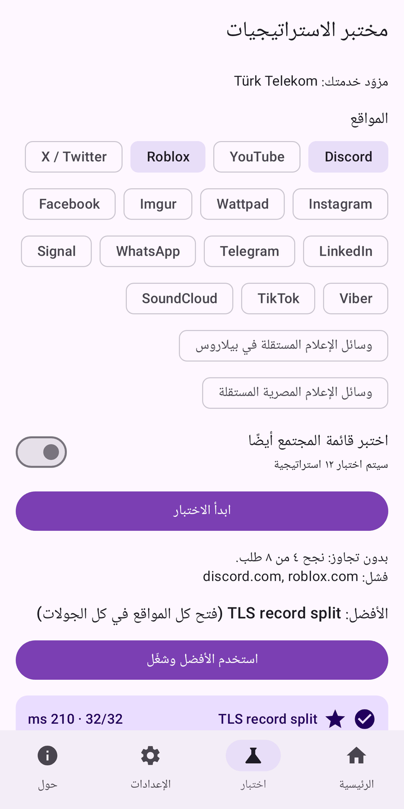
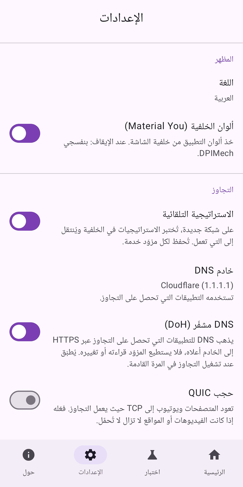
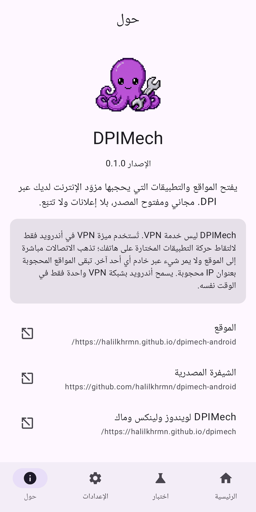

<div dir="rtl">

<p align="center"></p>

<h1 align="center">DPIMech for Android</h1>

<p align="center"><b>افتح المواقع والتطبيقات التي يحجبها مزوّد الإنترنت عبر DPI (ديسكورد، روبلوكس، يوتيوب…)<br>على هاتفك، بلا روت وبلا خادم بعيد.</b></p>

<p align="center">
<a href="https://github.com/halilkhrmn/dpimech-android/releases/latest"></a>
<a href="https://github.com/halilkhrmn/dpimech-android/actions/workflows/ci.yml"></a>
<a href="LICENSE"></a>

</p>

<p align="center">
<a href="README.md">English</a> · <a href="README.tr.md">Türkçe</a> · <a href="README.ru.md">Русский</a> · <a href="README.fa.md">فارسی</a> · العربية ·
<a href="https://halilkhrmn.github.io/dpimech-android/">الموقع</a>
</p>

> **متوفر للحاسوب أيضًا:** [DPIMech لويندوز ولينكس وماك](https://github.com/halilkhrmn/dpimech)
> يستخدم الاستراتيجيات نفسها. يتشارك التطبيقان قائمة استراتيجيات واحدة، فما يعمل لدى مزوّدك يعمل في كليهما.

> هذه الترجمة جديدة؛ إن وجدت خطأ أو عبارة غير واضحة فافتح بلاغًا (issue) من فضلك.

## التنزيل

| | |
|---|---|
| **GitHub Releases** | الملف [`dpimech-<الإصدار>-universal.apk`](https://github.com/halilkhrmn/dpimech-android/releases/latest) يعمل على كل الهواتف. ملفات APK أصغر لكل معمارية (`arm64-v8a` لمعظم الهواتف) و`SHA256SUMS` موجودة في الإصدار نفسه. |
| **Obtainium** | أضف `https://github.com/halilkhrmn/dpimech-android` لتصلك التحديثات تلقائيًا. |

أندرويد 8.0 أو أحدث.

## لقطات الشاشة

<p>





</p>

## الميزات

- **معالج إعداد:** اختر المواقع، فيختبر DPIMech اتصالك ويشغّل ما يعمل.
- **الهاتف كله أو تطبيقات مختارة:** المواقع المحجوبة عادةً في بلدك لكل التطبيقات، أو التطبيقات التي تختارها
  فقط (مثل ديسكورد). تبقى الاتصالات الأخرى كما هي.
- **مختبر الاستراتيجيات:** يختبر الاستراتيجيات على مواقع حقيقية مع جولات تأكيد، ويُظهر أيها يعمل لدى مزوّدك.
- **استراتيجية تلقائية لكل شبكة:** على شبكة Wi-Fi أو مشغّل جوال جديد تجد ما يعمل وتحفظه.
- **DNS مشفّر (DoH)** للتطبيقات التي تحصل على التجاوز، و**حجب اختياري لـ QUIC** حتى تستخدم المتصفحات ويوتيوب
  بروتوكول TCP حيث يعمل التجاوز.
- **حالة مباشرة:** مخطط الحركة ومتوسط زمن الاستجابة للمواقع وعدد استعلامات DNS في الشاشة الرئيسية والإشعار.
- **أدوات** (أداة لكل ملف إن شئت)، و**اختصارات** تشغّل ملفًا وتفتح تطبيقه، و**مربع الإعدادات السريعة**.
- **فحص سريع** لموقع واحد، و**نسخ احتياطي** للملفات في ملف، و**البدء عند تشغيل الهاتف** وVPN دائم التشغيل في أندرويد.
- العربية، فارسی، English، Türkçe، Русский. Material You، فاتح وداكن.

## كيف يعمل

يتعرّف كثير من المزوّدين على المواقع المحجوبة من الحزم الأولى للاتصال (اسم النطاق في مصافحة TLS).
يغيّر [ByeDPI](https://github.com/hufrea/byedpi) شكل هذه الحزم فلا يتعرّف عليها المرشّح، بينما يفهمها الموقع.

يستخدم DPIMech خدمة `VpnService` في أندرويد فقط لالتقاط حركة التطبيقات المختارة على الهاتف، ويمرّرها إلى
ByeDPI عبر [hev-socks5-tunnel](https://github.com/heiher/hev-socks5-tunnel).

- **ليس خدمة VPN.** يذهب كل اتصال مباشرة إلى الموقع. لا يمر شيء عبر خادم أي أحد آخر، ولا يُخفى عنوان IP الخاص بك.
- **تبقى المواقع المحجوبة بعنوان IP محجوبة.** لا تنفع أي حيلة محلية هنا.
- **شبكة VPN واحدة في الوقت نفسه.** يسمح أندرويد بواحدة فقط.

### الأذونات

| الإذن | السبب |
|---|---|
| VPN (`BIND_VPN_SERVICE`) | التقاط حركة التطبيقات المختارة على الهاتف |
| رؤية التطبيقات المثبّتة (`QUERY_ALL_PACKAGES`) | اختيار التطبيقات في الملفات |
| الإشعارات | الحالة، تقدّم اختبار الاستراتيجيات، «توقّف التجاوز» |
| تجاهل تحسين البطارية (يُطلب، اختياري) | حتى لا يوقف أندرويد التجاوز في الخلفية |
| التشغيل عند الإقلاع (`RECEIVE_BOOT_COMPLETED`) | «البدء عند تشغيل الهاتف» (متوقف ما لم تفعّله) |

### طلبات الشبكة التي يجريها التطبيق نفسه

- [ipwho.is](https://ipwho.is): اسم مزوّدك، لذاكرة كل شبكة والإعدادات المقترحة (يرى عنوان IP الخاص بك). في كل شبكة جديدة فقط مع الاستراتيجية التلقائية، وإلا فعند الاختبار فقط؛ الإيقاف: الإعدادات ← «التعرّف على مزوّد الشبكة».
- قوائم الاستراتيجيات على GitHub (مستودع نسخة الحاسوب وقائمة المجتمع).
- DNS over HTTPS إلى خادم DNS المختار في الإعدادات (Cloudflare افتراضيًا).
- المواقع التي تختبرها في مختبر الاستراتيجيات أو الفحص السريع.

لا تحليلات، ولا تقارير أعطال، ولا إعلانات.

## البناء

تحتاج JDK 17 أو أحدث، وAndroid SDK (المنصة 37) وNDK 29. انسخ المستودع مع الوحدات الفرعية:

```sh
git clone --recurse-submodules https://github.com/halilkhrmn/dpimech-android
cd dpimech-android
./gradlew :app:assembleDebug
```

الاختبارات وبناء الإصدارات وبنية المشروع موضحة في [AGENTS.md](AGENTS.md). بناء الإصدارات قابل لإعادة الإنتاج.

## شكر وتقدير

- [ByeDPI](https://github.com/hufrea/byedpi) من hufrea: محرّك التجاوز.
- [hev-socks5-tunnel](https://github.com/heiher/hev-socks5-tunnel) من heiher: من TUN إلى SOCKS5.
- استراتيجيات المجتمع من [ByeDPIManager](https://github.com/romanvht/ByeDPIManager).

يُبنى المحرّكان من الشيفرة المصدرية داخل ملف APK؛ لا يُنزَّل أي ملف تنفيذي لاحقًا.

## الرخصة

[GPL-3.0-or-later](LICENSE).

</div>
