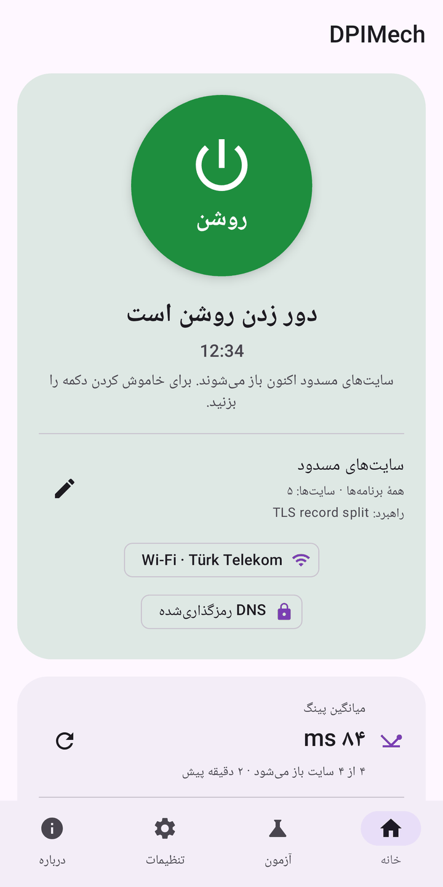
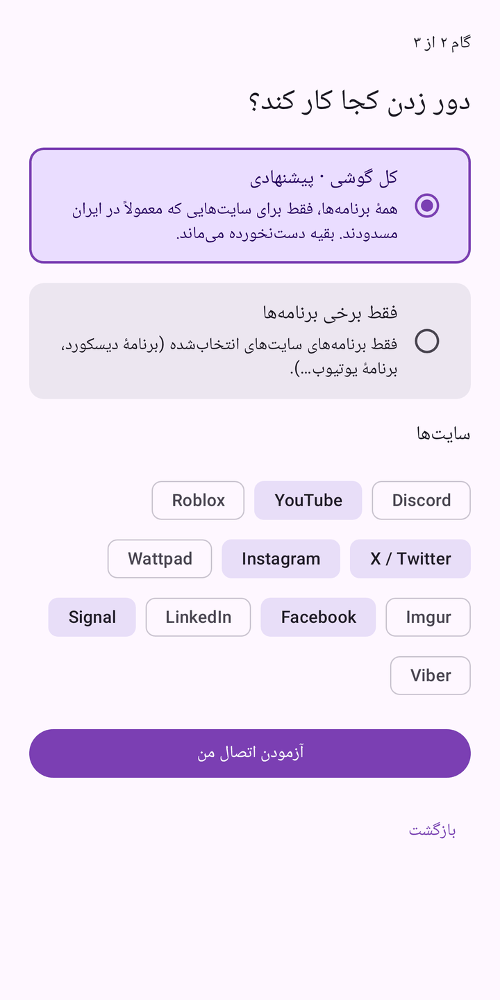
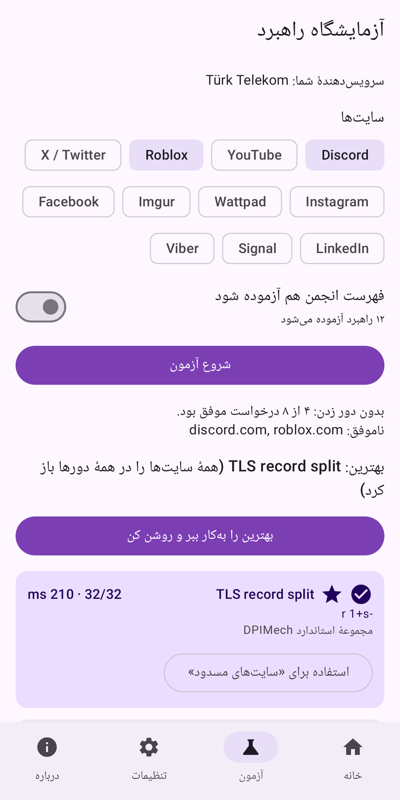
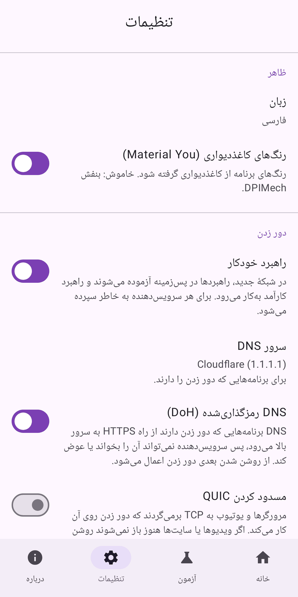
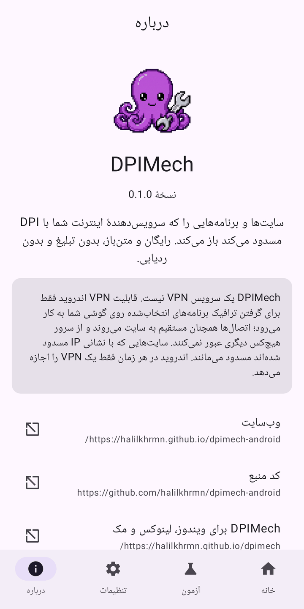

<div dir="rtl">

<p align="center"></p>

<h1 align="center">DPIMech for Android</h1>

<p align="center"><b>سایت‌ها و برنامه‌هایی را که سرویس‌دهندهٔ اینترنت با DPI مسدود می‌کند (یوتیوب، اینستاگرام، دیسکورد…)<br>روی گوشی خود باز کنید، بدون روت و بدون سرور راه‌دور.</b></p>

<p align="center">
<a href="https://github.com/halilkhrmn/dpimech-android/releases/latest"></a>
<a href="https://github.com/halilkhrmn/dpimech-android/actions/workflows/ci.yml"></a>
<a href="LICENSE"></a>

</p>

<p align="center">
<a href="README.md">English</a> · <a href="README.tr.md">Türkçe</a> · <a href="README.ru.md">Русский</a> · فارسی · <a href="README.ar.md">العربية</a> ·
<a href="https://halilkhrmn.github.io/dpimech-android/">وب‌سایت</a>
</p>

> **روی رایانه هم هست:** [DPIMech برای ویندوز، لینوکس و مک](https://github.com/halilkhrmn/dpimech)
> از همان راهبردها استفاده می‌کند. هر دو برنامه یک فهرست راهبرد مشترک دارند، پس آنچه روی
> سرویس‌دهندهٔ شما کار می‌کند در هر دو کار می‌کند.

> این ترجمه تازه است؛ اگر جایی نادرست یا نامفهوم است، لطفاً یک issue باز کنید.

## دریافت

| | |
|---|---|
| **GitHub Releases** | فایل [`dpimech-<نسخه>-universal.apk`](https://github.com/halilkhrmn/dpimech-android/releases/latest) روی هر گوشی کار می‌کند. APKهای کوچک‌تر برای هر معماری (`arm64-v8a` برای بیشتر گوشی‌ها) و `SHA256SUMS` در همان نسخه هستند. |
| **Obtainium** | نشانی `https://github.com/halilkhrmn/dpimech-android` را اضافه کنید تا به‌روزرسانی‌ها خودکار برسند. |

اندروید ۸٫۰ یا جدیدتر.

## تصویرها

<p>





</p>

## قابلیت‌ها

- **راهنمای راه‌اندازی:** سایت‌ها را انتخاب کنید؛ DPIMech اتصال شما را می‌آزماید و تنظیم کارآمد را روشن می‌کند.
- **کل گوشی یا برنامه‌های دلخواه:** سایت‌هایی که معمولاً در کشور شما مسدودند برای همهٔ برنامه‌ها، یا فقط
  برنامه‌هایی که انتخاب می‌کنید. اتصال‌های دیگر دست‌نخورده می‌مانند.
- **آزمایشگاه راهبرد:** راهبردها را روی سایت‌های واقعی با دورهای تأیید می‌آزماید و نشان می‌دهد کدام روی
  سرویس‌دهندهٔ شما کار می‌کند.
- **راهبرد خودکار برای هر شبکه:** در Wi-Fi یا اپراتور همراه جدید، راهبرد کارآمد را پیدا می‌کند و به خاطر می‌سپارد.
- **DNS رمزگذاری‌شده (DoH)** برای برنامه‌هایی که دور زدن دارند، و **مسدودسازی اختیاری QUIC** تا مرورگرها و
  یوتیوب از TCP استفاده کنند که دور زدن روی آن کار می‌کند.
- **وضعیت زنده:** نمودار ترافیک، میانگین پینگ سایت‌ها و شمار DNS در صفحهٔ اصلی و اعلان.
- **ابزارک‌ها**، **میان‌برهایی** که نمایه را روشن و برنامه‌اش را باز می‌کنند، **کاشی تنظیمات سریع**.
- **بررسی سریع** یک سایت، **پشتیبان‌گیری** از نمایه‌ها در یک فایل، **شروع با روشن شدن گوشی** و VPN همیشه روشن اندروید.
- فارسی، العربية، English، Türkçe، Русский. Material You، روشن و تیره.

## چگونه کار می‌کند

بسیاری از سرویس‌دهندگان سایت‌های مسدود را از نخستین بسته‌های اتصال (نام دامنه در دست‌دهی TLS) می‌شناسند.
[ByeDPI](https://github.com/hufrea/byedpi) شکل این بسته‌ها را تغییر می‌دهد تا فیلتر آن‌ها را نشناسد، اما
سایت همچنان آن‌ها را می‌فهمد.

DPIMech از `VpnService` اندروید فقط برای گرفتن ترافیک برنامه‌های انتخاب‌شده روی گوشی استفاده می‌کند و آن را
از راه [hev-socks5-tunnel](https://github.com/heiher/hev-socks5-tunnel) به ByeDPI می‌دهد.

- **سرویس VPN نیست.** هر اتصال همچنان مستقیم به سایت می‌رود. از سرور هیچ‌کس دیگری عبور نمی‌کند و نشانی IP شما پنهان نمی‌شود.
- **سایت‌هایی که با نشانی IP مسدود شده‌اند مسدود می‌مانند.** در شبکه‌هایی که با فهرست سفید یا مسدودسازی IP
  کار می‌کنند، DPIMech ممکن است کمکی نکند.
- **در هر زمان یک VPN.** اندروید فقط یکی را اجازه می‌دهد.

### مجوزها

| مجوز | چرا |
|---|---|
| VPN (`BIND_VPN_SERVICE`) | گرفتن ترافیک برنامه‌های انتخاب‌شده روی گوشی |
| دیدن برنامه‌های نصب‌شده (`QUERY_ALL_PACKAGES`) | انتخاب برنامه در نمایه‌ها |
| اعلان‌ها | وضعیت، پیشرفت آزمون راهبرد، «دور زدن متوقف شد» |
| نادیده گرفتن بهینه‌سازی باتری (پرسیده می‌شود، اختیاری) | تا اندروید دور زدن را در پس‌زمینه متوقف نکند |
| اجرا هنگام روشن شدن (`RECEIVE_BOOT_COMPLETED`) | «شروع با روشن شدن گوشی» (تا خودتان روشن نکنید خاموش است) |

### درخواست‌های شبکه‌ای که خود برنامه انجام می‌دهد

- [ipwho.is](https://ipwho.is): نام سرویس‌دهندهٔ شما، برای حافظهٔ هر شبکه و پیشنهادها.
- فهرست‌های راهبرد در GitHub (مخزن نسخهٔ رایانه و فهرست انجمن).
- DNS over HTTPS به سرور DNS انتخاب‌شده در تنظیمات (به‌طور پیش‌فرض Cloudflare).
- سایت‌هایی که در آزمایشگاه راهبرد یا بررسی سریع می‌آزمایید.

بدون تحلیل، بدون گزارش خرابی، بدون تبلیغ.

## ساختن

به JDK 17 یا بالاتر، Android SDK (پلتفرم 37) و NDK 29 نیاز دارید. همراه با زیرماژول‌ها کلون کنید:

```sh
git clone --recurse-submodules https://github.com/halilkhrmn/dpimech-android
cd dpimech-android
./gradlew :app:assembleDebug
```

آزمون‌ها، ساخت نسخهٔ انتشار و ساختار پروژه در [AGENTS.md](AGENTS.md) آمده‌اند. ساخت‌های انتشار بازتولیدپذیرند.

## سپاس

- [ByeDPI](https://github.com/hufrea/byedpi) از hufrea: موتور دور زدن.
- [hev-socks5-tunnel](https://github.com/heiher/hev-socks5-tunnel) از heiher: از TUN به SOCKS5.
- راهبردهای انجمن از [ByeDPIManager](https://github.com/romanvht/ByeDPIManager).

هر دو موتور از کد منبع درون APK ساخته می‌شوند؛ بعداً هیچ فایل اجرایی دانلود نمی‌شود.

## مجوز

[GPL-3.0-or-later](LICENSE).

</div>
