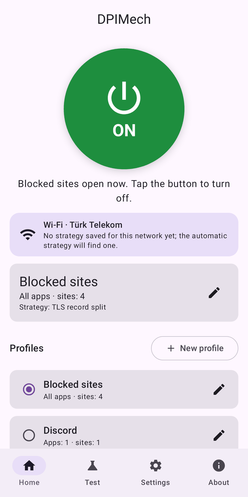
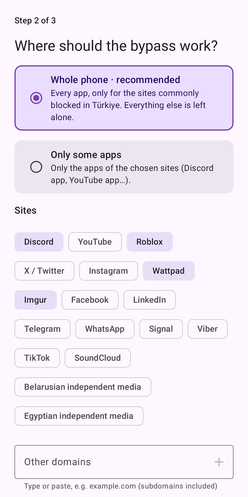
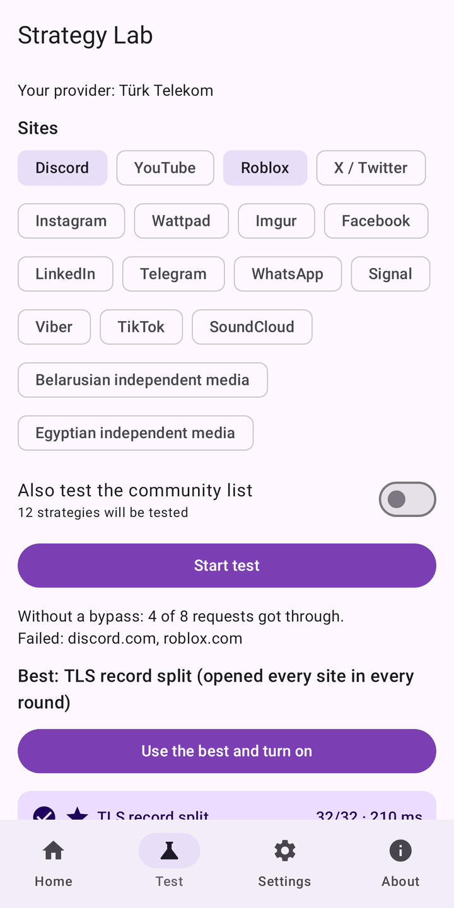
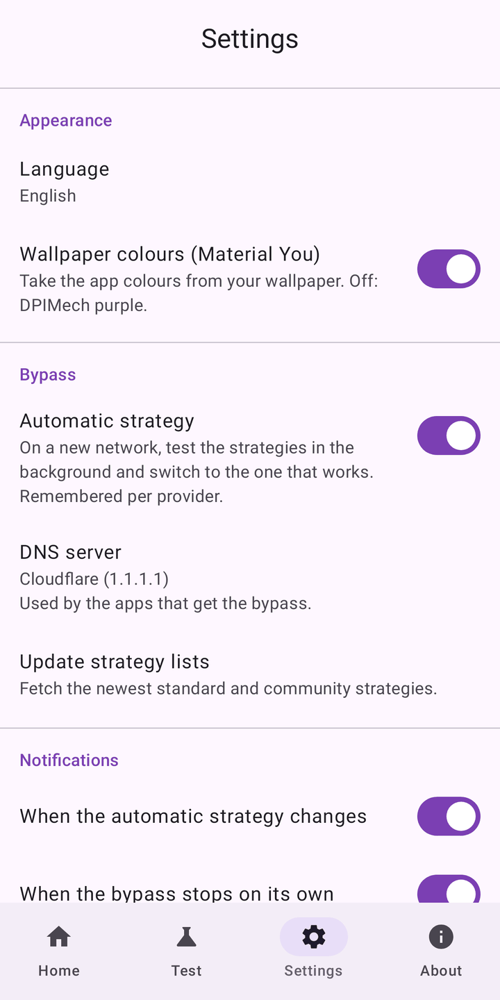
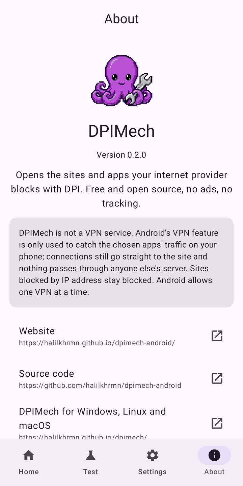

<p align="center"></p>

<h1 align="center">DPIMech for Android</h1>

<p align="center"><b>Open the sites and apps your internet provider blocks with DPI (Discord, YouTube, Roblox…)<br>on your phone, without root and without a remote server.</b></p>

<p align="center">
<a href="https://github.com/halilkhrmn/dpimech-android/releases/latest"></a>
<a href="https://github.com/halilkhrmn/dpimech-android/actions/workflows/ci.yml"></a>
<a href="LICENSE"></a>

</p>

<p align="center">
English · <a href="README.tr.md">Türkçe</a> · <a href="README.ru.md">Русский</a> ·
<a href="https://halilkhrmn.github.io/dpimech-android/">Website</a>
</p>

> **Also on the computer:** [DPIMech for Windows, Linux and macOS](https://github.com/halilkhrmn/dpimech)
> uses the same strategies. Both apps share one strategy list, so what works on your provider
> works in both.

## Download

| | |
|---|---|
| **GitHub Releases** | [`dpimech-<version>-universal.apk`](https://github.com/halilkhrmn/dpimech-android/releases/latest) works on every phone. Smaller per-architecture APKs (`arm64-v8a` for most phones) and `SHA256SUMS` are in the same release. |
| **Obtainium** | Add `https://github.com/halilkhrmn/dpimech-android` to get updates automatically. |

Android 8.0 or newer.

## Screenshots

<p>





</p>

## Features

- **Setup wizard:** pick the sites, DPIMech tests your connection and turns on what works.
- **Whole phone or chosen apps:** the sites commonly blocked in your country for every app, or
  only the apps you pick (e.g. Discord). Other connections are left untouched.
- **Strategy Lab:** tests strategies against real sites, with confirmation rounds, and shows which
  one works on your provider. Presets for known providers are tried first.
- **Automatic strategy per network:** on a new Wi-Fi or mobile operator it finds what works and
  remembers it.
- **Encrypted DNS (DoH)** for the bypassed apps, and an optional **QUIC block** so browsers and
  YouTube use TCP, where the bypass works.
- **Live status:** traffic chart, average ping of your sites and DNS counts on the home screen and
  in the notification.
- **Widgets** (one per profile if you like), **launcher shortcuts** that turn a profile on and open
  its app, **Quick Settings tile**.
- Strategies updated without a new release, plus a community list; DNS blocking check; watchdog
  that restarts the engine; logs and problem report.
- English, Türkçe, Русский. Material You, light and dark.

## How it works

Many providers recognise blocked sites by reading the first packets of a connection (the domain
name in the TLS handshake). [ByeDPI](https://github.com/hufrea/byedpi) changes how those packets
look, so the filter does not recognise them, while the site still understands them.

DPIMech uses Android's `VpnService` only to catch the chosen apps' traffic on the phone and hands
it to ByeDPI through [hev-socks5-tunnel](https://github.com/heiher/hev-socks5-tunnel).

- **Not a VPN service.** Every connection still goes straight to the site. Nothing passes through
  anyone else's server, and your IP address is not hidden.
- **Sites blocked by IP address stay blocked.** No local trick helps there.
- **One VPN at a time.** Android allows only one, so another VPN or a VPN-based ad blocker cannot
  run together with DPIMech.

### Permissions

| Permission | Why |
|---|---|
| VPN (`BIND_VPN_SERVICE`) | catch the chosen apps' traffic on the phone |
| See installed apps (`QUERY_ALL_PACKAGES`) | the app picker for per-app profiles |
| Notifications | status, strategy test progress, "bypass stopped" |
| Ignore battery optimisation (asked, optional) | so Android does not stop the bypass in the background |

### Network requests made by the app itself

- [ipwho.is](https://ipwho.is): your provider's name, for the per-network memory and the presets.
- The strategy lists on GitHub (desktop repository and community list).
- DNS over HTTPS to the DNS server chosen in Settings (Cloudflare by default).
- The sites you test, during the Strategy Lab.

No analytics, no crash reporting, no ads.

## Building

You need JDK 17+, the Android SDK (platform 37) and NDK 29. Clone with submodules:

```sh
git clone --recurse-submodules https://github.com/halilkhrmn/dpimech-android
cd dpimech-android
./gradlew :app:assembleDebug
```

Tests, release builds and the project layout are described in [AGENTS.md](AGENTS.md).
[docs/RELEASING.md](docs/RELEASING.md) covers signing and [docs/PLAN.md](docs/PLAN.md) the plan.
Release builds are reproducible.

## Credits

- [ByeDPI](https://github.com/hufrea/byedpi) by hufrea: the bypass engine.
- [hev-socks5-tunnel](https://github.com/heiher/hev-socks5-tunnel) by heiher: TUN to SOCKS5.
- Community strategies from [ByeDPIManager](https://github.com/romanvht/ByeDPIManager).

Both engines are built from source inside the APK; nothing executable is downloaded later.

## Licence

[GPL-3.0-or-later](LICENSE).
