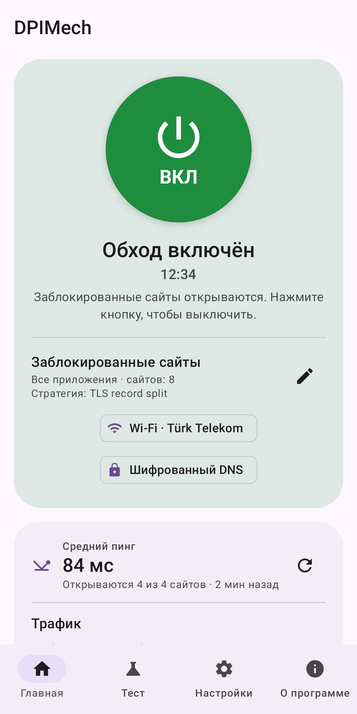
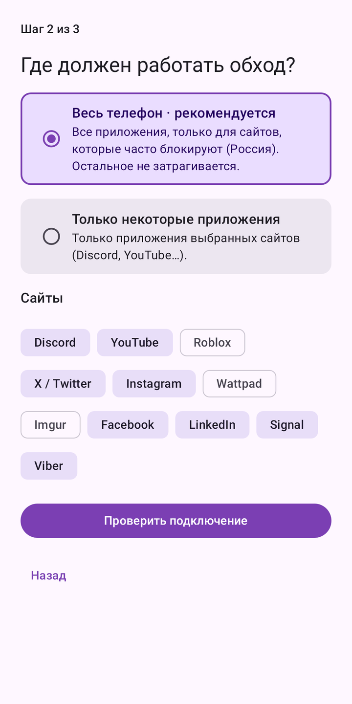
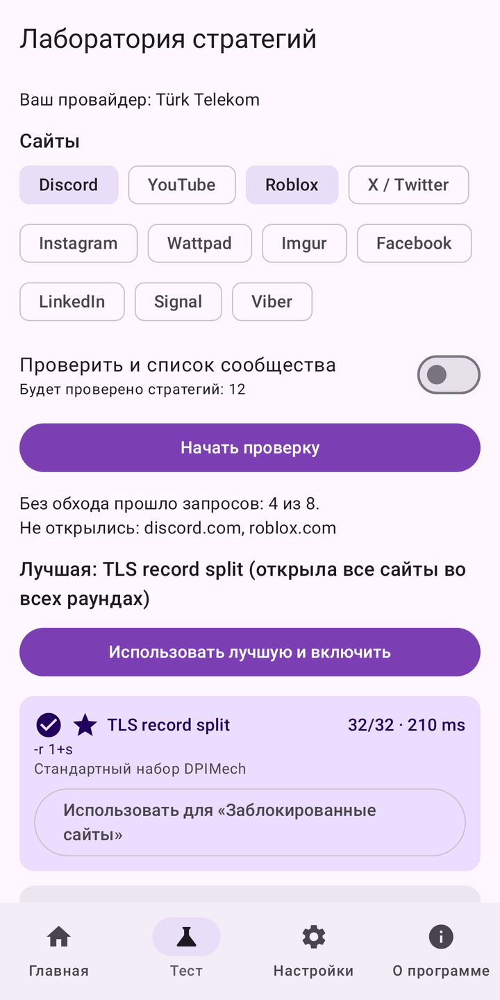
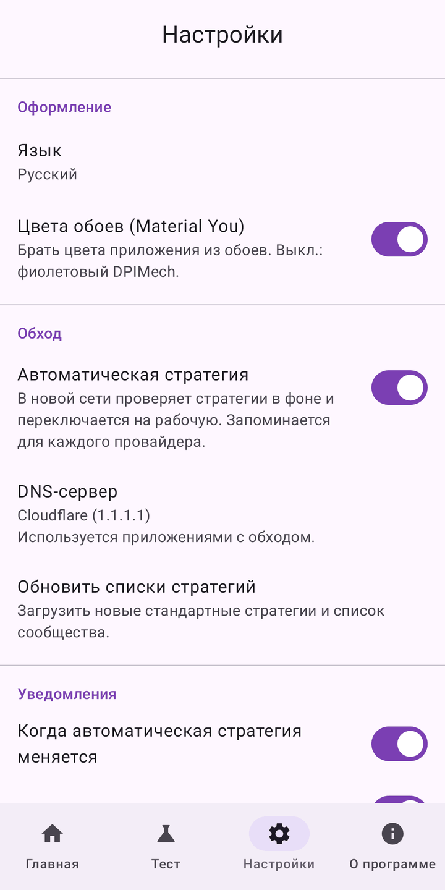
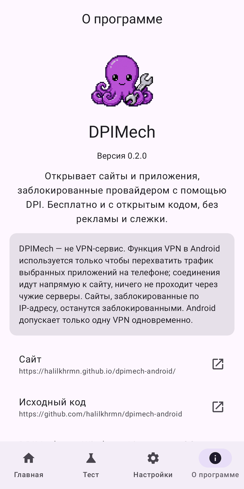

<p align="center"></p>

<h1 align="center">DPIMech for Android</h1>

<p align="center"><b>Открывайте сайты и приложения, которые провайдер блокирует через DPI (Discord, YouTube, Roblox…),<br>прямо на телефоне — без root и без удалённого сервера.</b></p>

<p align="center">
<a href="https://github.com/halilkhrmn/dpimech-android/releases/latest"></a>
<a href="https://github.com/halilkhrmn/dpimech-android/actions/workflows/ci.yml"></a>
<a href="LICENSE"></a>

</p>

<p align="center">
<a href="README.md">English</a> · <a href="README.tr.md">Türkçe</a> · Русский · <a href="README.fa.md">فارسی</a> · <a href="README.ar.md">العربية</a> ·
<a href="https://halilkhrmn.github.io/dpimech-android/">Сайт</a>
</p>

> **Есть и для компьютера:** [DPIMech для Windows, Linux и macOS](https://github.com/halilkhrmn/dpimech).
> Оба приложения используют один список стратегий: что работает у вашего провайдера, работает в обоих.

## Скачать

| | |
|---|---|
| **GitHub Releases** | [`dpimech-<версия>-universal.apk`](https://github.com/halilkhrmn/dpimech-android/releases/latest) работает на любом телефоне. В том же выпуске есть APK поменьше для отдельных архитектур (`arm64-v8a` для большинства телефонов) и `SHA256SUMS`. |
| **Obtainium** | Добавьте `https://github.com/halilkhrmn/dpimech-android`, чтобы получать обновления автоматически. |

Android 8.0 и новее.

## Скриншоты

<p>





</p>

## Возможности

- **Мастер настройки:** выберите сайты — DPIMech проверит подключение и включит то, что работает.
- **Весь телефон или выбранные приложения:** сайты, которые часто блокируют в вашей стране, для всех
  приложений, или только выбранные приложения (например, Discord). Остальные соединения не затрагиваются.
- **Лаборатория стратегий:** проверяет стратегии на реальных сайтах с повторными раундами и показывает,
  что работает у вашего провайдера. Пресеты для известных провайдеров проверяются первыми.
- **Автостратегия для каждой сети:** в новой сети Wi-Fi или у нового оператора находит рабочую
  стратегию и запоминает её.
- **Шифрованный DNS (DoH)** для приложений с обходом и **блокировка QUIC** по желанию, чтобы браузеры и
  YouTube шли через TCP, где обход работает.
- **Состояние в реальном времени:** график трафика, средний пинг сайтов и счётчики DNS на главном
  экране и в уведомлении.
- **Виджеты** (можно по одному на профиль), **ярлыки**, которые включают профиль и открывают его
  приложение, **плитка быстрых настроек**.
- Стратегии обновляются без нового выпуска, есть список сообщества; проверка блокировки через DNS;
  перезапуск движка при сбое; журнал и отчёт о проблеме.
- **Быстрая проверка** одного сайта (напрямую и через обход), **резервная копия** профилей в файл,
  **запуск при включении** и постоянная VPN Android.
- Русский, English, Türkçe, فارسی, العربية (персидский и арабский новые: исправления приветствуются).
  Material You, светлая и тёмная тема.

## Как это работает

Многие провайдеры узнают заблокированные сайты по первым пакетам соединения (имени домена в
TLS-рукопожатии). [ByeDPI](https://github.com/hufrea/byedpi) меняет вид этих пакетов: фильтр их не
распознаёт, а сайт по-прежнему понимает.

DPIMech использует `VpnService` Android только для перехвата трафика выбранных приложений на телефоне
и передаёт его в ByeDPI через [hev-socks5-tunnel](https://github.com/heiher/hev-socks5-tunnel).

- **Это не VPN-сервис.** Каждое соединение идёт напрямую к сайту. Ничего не проходит через чужие
  серверы, IP-адрес не скрывается.
- **Сайты, заблокированные по IP, остаются заблокированными.** Локальные приёмы здесь не помогают.
- **Одна VPN одновременно.** Android допускает только одну, поэтому другая VPN или блокировщик рекламы
  на основе VPN не могут работать вместе с DPIMech.

### Разрешения

| Разрешение | Зачем |
|---|---|
| VPN (`BIND_VPN_SERVICE`) | перехват трафика выбранных приложений на телефоне |
| Список установленных приложений (`QUERY_ALL_PACKAGES`) | выбор приложений для профилей |
| Уведомления | состояние, ход теста стратегий, «обход остановлен» |
| Игнорировать оптимизацию батареи (по запросу, необязательно) | чтобы Android не останавливал обход в фоне |
| Запуск при включении (`RECEIVE_BOOT_COMPLETED`) | «Запускать при включении телефона» (выключено, пока вы не включите) |

### Сетевые запросы самого приложения

- [ipwho.is](https://ipwho.is): название провайдера — для памяти по сетям и пресетов.
- Списки стратегий на GitHub (репозиторий версии для компьютера и список сообщества).
- DNS over HTTPS к DNS-серверу, выбранному в настройках (по умолчанию Cloudflare).
- Сайты, которые вы проверяете в лаборатории стратегий.

Никакой аналитики, отчётов о сбоях и рекламы.

## Сборка

Нужны JDK 17+, Android SDK (платформа 37) и NDK 29. Клонируйте вместе с подмодулями:

```sh
git clone --recurse-submodules https://github.com/halilkhrmn/dpimech-android
cd dpimech-android
./gradlew :app:assembleDebug
```

Тесты, release-сборка и устройство проекта описаны в [AGENTS.md](AGENTS.md), подпись — в
[docs/RELEASING.md](docs/RELEASING.md), план — в [docs/PLAN.md](docs/PLAN.md). Release-сборки
воспроизводимы.

## Благодарности

- [ByeDPI](https://github.com/hufrea/byedpi) (hufrea): движок обхода.
- [hev-socks5-tunnel](https://github.com/heiher/hev-socks5-tunnel) (heiher): TUN → SOCKS5.
- Стратегии сообщества из [ByeDPIManager](https://github.com/romanvht/ByeDPIManager).

Оба движка собираются из исходного кода внутри APK; исполняемые файлы потом не загружаются.

## Лицензия

[GPL-3.0-or-later](LICENSE).
