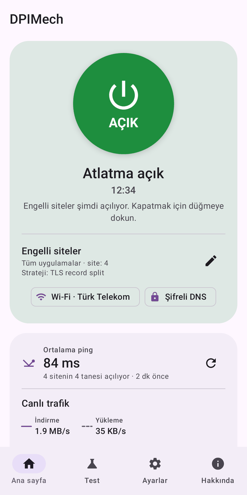
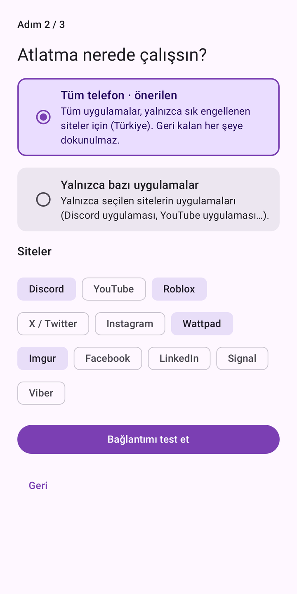
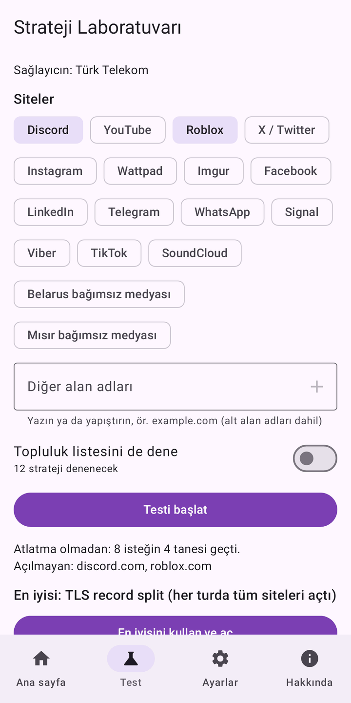
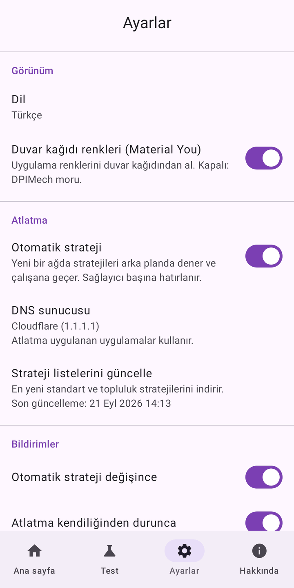
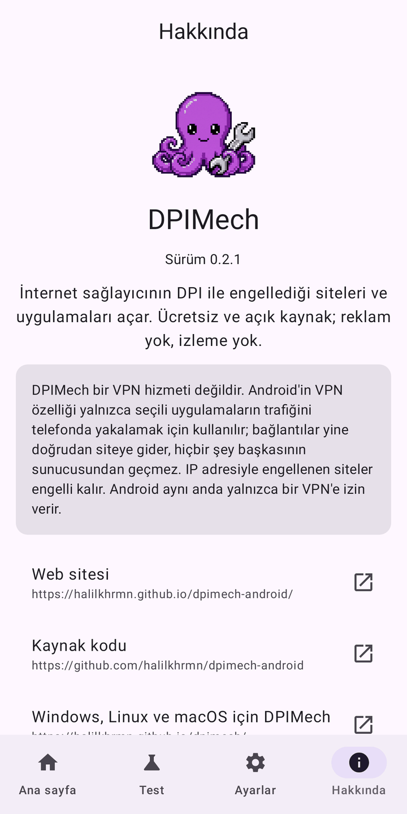

<p align="center"></p>

<h1 align="center">DPIMech for Android</h1>

<p align="center"><b>İnternet sağlayıcının DPI ile engellediği siteleri ve uygulamaları (Discord, YouTube, Roblox…)<br>telefonunda aç. Root ya da uzak sunucu gerekmez.</b></p>

<p align="center">
<a href="https://github.com/halilkhrmn/dpimech-android/releases/latest"></a>
<a href="https://github.com/halilkhrmn/dpimech-android/actions/workflows/ci.yml"></a>
<a href="LICENSE"></a>

</p>

<p align="center">
<a href="README.md">English</a> · Türkçe · <a href="README.ru.md">Русский</a> ·
<a href="https://halilkhrmn.github.io/dpimech-android/">Web sitesi</a>
</p>

> **Bilgisayarda da var:** [Windows, Linux ve macOS için DPIMech](https://github.com/halilkhrmn/dpimech).
> İki uygulama aynı strateji listesini kullanır; sağlayıcında çalışan strateji ikisinde de çalışır.

## İndir

| | |
|---|---|
| **GitHub Releases** | [`dpimech-<sürüm>-universal.apk`](https://github.com/halilkhrmn/dpimech-android/releases/latest) her telefonda çalışır. Aynı sürümde mimariye özel daha küçük APK'lar (çoğu telefon için `arm64-v8a`) ve `SHA256SUMS` dosyası da var. |
| **Obtainium** | Güncellemeleri otomatik almak için `https://github.com/halilkhrmn/dpimech-android` adresini ekle. |

Android 8.0 ve üstü.

## Ekran görüntüleri

<p>





</p>

## Özellikler

- **Kurulum sihirbazı:** siteleri seç; DPIMech bağlantını test eder ve çalışanı açar.
- **Tüm telefon ya da seçili uygulamalar:** ülkende sık engellenen siteler için tüm uygulamalar ya da
  yalnızca seçtiklerin (ör. Discord). Diğer bağlantılara dokunulmaz.
- **Strateji Laboratuvarı:** stratejileri gerçek sitelerde doğrulama turlarıyla dener ve sağlayıcında
  hangisinin çalıştığını gösterir. Bilinen sağlayıcıların önerileri önce denenir.
- **Ağa göre otomatik strateji:** yeni bir Wi-Fi'da ya da mobil operatörde çalışanı bulur ve hatırlar.
- Atlatılan uygulamalar için **şifreli DNS (DoH)**. İsteğe bağlı **QUIC engeli**, tarayıcıları ve
  YouTube'u atlatmanın çalıştığı TCP'ye geçirir.
- **Canlı durum:** ana ekranda ve bildirimde trafik grafiği, sitelerinin ortalama ping'i ve DNS sayıları.
- **Widget'lar** (istersen her profile bir tane), profili açıp uygulamasını başlatan **kısayollar**,
  **Hızlı Ayarlar kutucuğu**.
- Yeni sürüm gerekmeden güncellenen stratejiler ve topluluk listesi, DNS engeli kontrolü, motoru
  yeniden başlatan bekçi, günlük ve sorun bildirme.
- Türkçe, English, Русский. Material You, açık ve koyu tema.

## Nasıl çalışır

Birçok sağlayıcı engelli siteleri bağlantının ilk paketlerinden, yani TLS el sıkışmasındaki alan
adından tanır. [ByeDPI](https://github.com/hufrea/byedpi) bu paketlerin görünüşünü değiştirir;
filtre onları tanımaz ama site anlamaya devam eder.

DPIMech, Android'in `VpnService` özelliğini yalnızca seçilen uygulamaların trafiğini telefonda
yakalamak için kullanır. Trafiği [hev-socks5-tunnel](https://github.com/heiher/hev-socks5-tunnel)
üzerinden ByeDPI'ye verir.

- **VPN hizmeti değildir.** Her bağlantı yine doğrudan siteye gider. Hiçbir şey başkasının sunucusundan
  geçmez ve IP adresin gizlenmez.
- **IP adresiyle engellenen siteler engelli kalır.** Telefondaki bir yöntem bunu aşamaz.
- **Aynı anda tek VPN.** Android yalnızca birine izin verir; başka bir VPN ya da VPN tabanlı reklam
  engelleyici DPIMech ile birlikte çalışamaz.

### İzinler

| İzin | Neden |
|---|---|
| VPN (`BIND_VPN_SERVICE`) | seçilen uygulamaların trafiğini telefonda yakalamak |
| Yüklü uygulamaları görme (`QUERY_ALL_PACKAGES`) | uygulamaya özel profillerdeki uygulama seçici |
| Bildirimler | durum, strateji testi ilerlemesi, "atlatma durdu" |
| Pil optimizasyonunu yok sayma (sorulur, isteğe bağlı) | Android atlatmayı arka planda durdurmasın |

### Uygulamanın kendi yaptığı ağ istekleri

- [ipwho.is](https://ipwho.is): sağlayıcının adı; ağa göre hafıza ve öneriler için.
- GitHub'daki strateji listeleri (masaüstü deposu ve topluluk listesi).
- Ayarlarda seçilen DNS sunucusuna DNS over HTTPS (varsayılan Cloudflare).
- Strateji Laboratuvarı sırasında test ettiğin siteler.

Analitik yok, hata raporu gönderimi yok, reklam yok.

## Derleme

JDK 17+, Android SDK (platform 37) ve NDK 29 gerekir. Alt modüllerle birlikte klonla:

```sh
git clone --recurse-submodules https://github.com/halilkhrmn/dpimech-android
cd dpimech-android
./gradlew :app:assembleDebug
```

Testler, release derlemesi ve proje yapısı [AGENTS.md](AGENTS.md) dosyasında. İmzalama için
[docs/RELEASING.md](docs/RELEASING.md), plan için [docs/PLAN.md](docs/PLAN.md). Release derlemeleri
yeniden üretilebilir (reproducible).

## Teşekkürler

- [ByeDPI](https://github.com/hufrea/byedpi) (hufrea): atlatma motoru.
- [hev-socks5-tunnel](https://github.com/heiher/hev-socks5-tunnel) (heiher): TUN'dan SOCKS5'e.
- Topluluk stratejileri: [ByeDPIManager](https://github.com/romanvht/ByeDPIManager).

İki motor da APK'nın içinde kaynak koddan derlenir; sonradan çalıştırılabilir dosya indirilmez.

## Lisans

[GPL-3.0-or-later](LICENSE).
